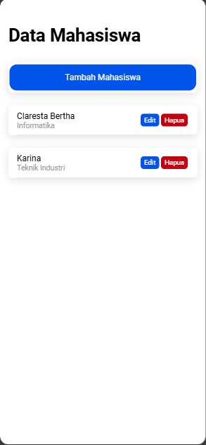

# Tugas 8
Nama : Claresta Berthalita Jatmika

NIM : H1D022050

Shift Baru: F

### Cara Kerja Proses CRUD Mahasiswa
#### 1. Proses Read (Menampilkan data mahasiswa)
Saat pertama kali halaman dibuka, fungsi 'ngOnInit()' pada file 'mahasiswa.page.ts' akan otomatis memanggil fungsi 'getMahasiswa()'. Dimana fungsi 'getMahasiswa()' ini akan memanggil metode tampil() dari ApiService yang mengirimkan request GET ke endpoint 'tampil.php' untuk mengambil data mahasiswa dari server. Apabila berhasil, data mahasiswa akan disimpan ke variabel 'dataMahasiswa' dan halaman akan otomatis menampilkan data ini melalui 'ngFor="let item of dataMahasiswa"'. 
```ts
ngOnInit() {
    this.getMahasiswa();
  }

  getMahasiswa() {
    this.api.tampil('tampil.php').subscribe({
      next: (res: any) => {
        console.log('sukses', res);
        this.dataMahasiswa = res;
      },
      error: (err: any) => {
        console.log(err);
      },
    });
  }
```

Dari gambar diatas ditampilkan data mahasiswa dalam bentuk list card yang diatur pada file 'mahasiswa.page.html' dengan menggunakan perulangan 'ngFor'. 
```html
<ion-card *ngFor="let item of dataMahasiswa">
    <ion-item>
      <ion-label>
        {{item.nama}}
        <p>{{item.jurusan}}</p>
      </ion-label>
      <ion-button expand="block" (click)="openModalEdit(true,item.id)">Edit</ion-button>
      <ion-button color="danger" slot="end" (click)="confirmDelete(item.id)">Hapus</ion-button>
    </ion-item>
  </ion-card>
```

#### 2. Proses Create (Menambahkan Data Mahasiswa)
Pada halaman utama, jika tombol "Tambah Mahasiswa" ditekan, fungsi 'openModalTambah(true)' dijalankan yang membuat sistem membuka modal tambah data. Jika modal terbuka akan ditampilkan form yang berisi inputan nama dan jurusan mahasiswa seperti gambar dibawah ini.

Disini saya mengisi nama = Karina dengan jurusan = Teknik Sipil. Lalu dibawahnya terdapat tombol "Tambah Mahasiswa" yang apabila ditekan fungsi 'tambahMahasiswa()' akan dipanggil. Fungsi ini akan memeriksa apakah nama dan jurusan tidak kosong. Jika tidak kosong, data diinputkan dalam objek 'data' yang dikirim ke server dengan metode 'tambah()' dari ApiService melalui request POST ke endpoint 'tambah.php'
```ts
tambahMahasiswa() {
  if (this.nama != '' && this.jurusan != '') {
    let data = {
      nama: this.nama,
      jurusan: this.jurusan,
    }
    this.api.tambah(data, 'tambah.php')
      .subscribe({
        next: (hasil: any) => {
          this.resetModal();
          console.log('berhasil tambah mahasiswa');
          this.getMahasiswa();
          this.modalTambah = false;
          this.modal.dismiss();
        },
        error: (err: any) => {
          console.log('gagal tambah mahasiswa');
        }
      })
  } else {
    console.log('gagal tambah mahasiswa karena masih ada data yg kosong');
  }
}
```
Setelah tambah data berhasil, maka 'resetModal()' dipanggil untuk mengosongkan input pada modal. Selanjutnya fungsi 'getMahasiswa()' kembali dijalankan untuk merefresh data yang sudah ditambah. Modal ditutul dengan 'this.modal.dismiss()' dan 'this.modalTambah' diatur ke false. Maka tampilannya akan seperti gambar dibawah.


#### 3. Proses Update (Mengedit Data Mahasiswa)
Pada halaman utama apabila di tekan tombol "Edit" pada salah satu data mahasiswa maka fungsi 'openModalEdit(true, item.id)' akan dijalankan. Setelah modal terbuka maka akan memanggil fungsi 'ambilMahasiswa(id:any)' dengan mengirim permintaan GET menggunakan metode 'lihat()' pada ApiService ke endpoint 'lihat.php?id=<id_mahasiswa>' untuk mengambil data mahasiswa. jika permintaan berhasil, data mahasiswa akan diisi ke variabel id, nama, dan jurusan sehingga data mahasiswa dapat ditampilkan di modal edit.
```ts
ambilMahasiswa(id: any) {
  this.api.lihat(id,
    'lihat.php?id=').subscribe({
      next: (hasil: any) => {
        console.log('sukses', hasil);
        let mahasiswa = hasil;
        this.id = mahasiswa.id;
        this.nama = mahasiswa.nama;
        this.jurusan = mahasiswa.jurusan;
      },
      error: (error: any) => {
        console.log('gagal ambil data');
      }
    })
}
```
Selanjutnya pengguna bisa mengubah data pada formulir edit. Disini saya mengedit jurusannya menjadi Teknik Industri seperti gambar dibawah ini. 

Lalu setelah itu, tekan tombol "Edit Mahasiswa" dan fungsi 'editMahasiswa()' dijalankan. Pada fungsi tersebut, data akan diperbarui dan dimasukkan dalam objek 'data' lalu dikirimkan menggunakan metode 'edit()' dari ApiService melalui request PUT ke endpoint 'edit.php'. Apabila berhasil, fungsi 'resetModal()' dijalankan untuk mengosongkan input modal dan fungsi 'getMahasiswa()' kembali dijalankan untuk memperbarui data mahasiswa pada halaman utama. Hasilnya dapat dilihat di bawah ini.

```ts
editMahasiswa() {
  let data = {
    id: this.id,
    nama: this.nama,
    jurusan: this.jurusan
  }
  this.api.edit(data, 'edit.php')
    .subscribe({
      next: (hasil: any) => {
        console.log(hasil);
        this.resetModal();
        this.getMahasiswa();
        console.log('berhasil edit Mahasiswa');
        this.modalEdit = false;
        this.modal.dismiss();
      },
      error: (err: any) => {
        console.log('gagal edit Mahasiswa');
      }
    })
}
```

#### 4. Proses Delete (Menghapus Data Mahasiswa)
Saat pengguna menekan tombol "Hapus" pada salah satu data mahasiswa fungsi 'confirmDelete(id)' dipanggil. Selanjutnya fungsi ini akan membuka alert konfirmasi yang meminta pengguna mengkonfirmasi penghapusan data seperti gambar dibawah ini.

Jika pengguna memilih ya, maka fungsi 'hapusMahasiswa(id)' dipanggil. Fungsi ini memanggil metode 'hapus()' pada ApiService yang mengirimkan request DELETE ke endpoint 'hapus.php?id=<id_mahasiswa>' untuk menghapus data mahasiswa berdasar id yang diberikan. Jika berhasil, fungsi 'getMahasiswa()' kembali dijalankan untuk memperbarui daftar mahasiswa pada halaman utama. Tampilannya seperti gambar dibawah ini

```ts
async confirmDelete(id:any){
  const alert = await this.alertController.create({
    header:'Konfirmasi Hapus Data',
    message:'Apakah anda yakin ingin menghapus data ini?',
    buttons:[
      {
        text: 'Tidak',
        role: 'cancel',
        handler:()=>{
          console.log('Penghapusan dibatalkan');
        }
      },
      {
        text:'Ya',
        handler:()=>{
          this.hapusMahasiswa(id);
        }
      }
    ]
  });
  await alert.present();
}

hapusMahasiswa(id: any) {
  this.api.hapus(id,
    'hapus.php?id=').subscribe({
      next: (res: any) => {
        console.log('sukses', res);
        this.getMahasiswa();
        console.log('berhasil hapus data');
      },
      error: (error: any) => {
        console.log('gagal');
      }
    })
}
```